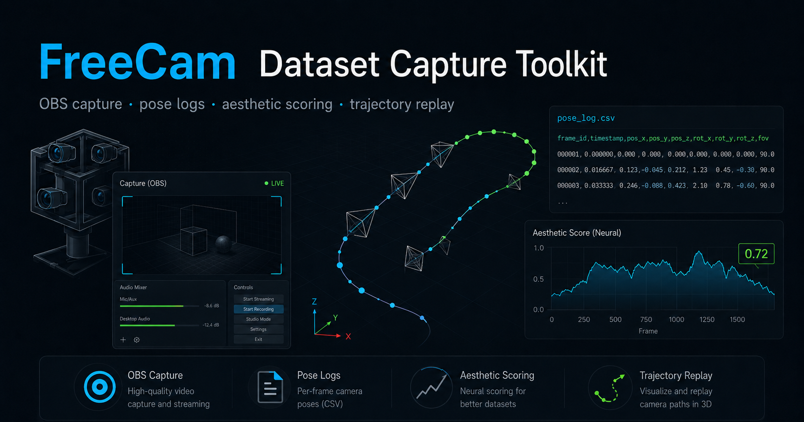
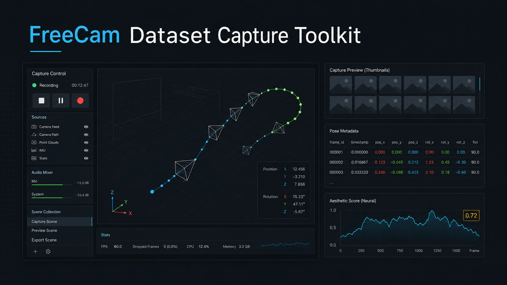
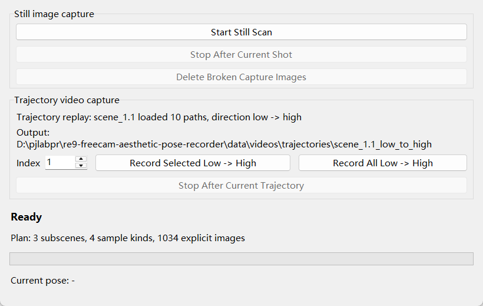
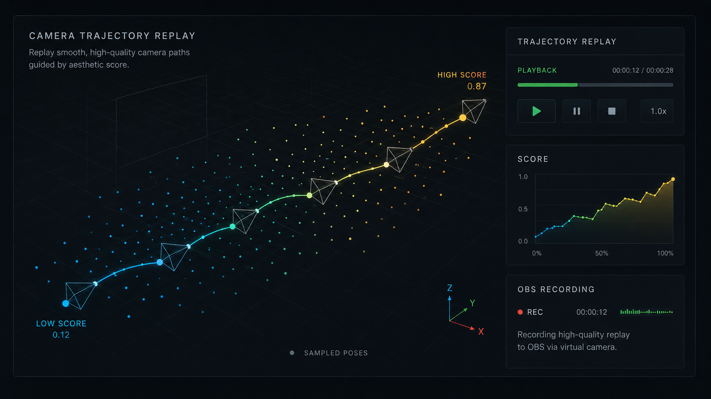
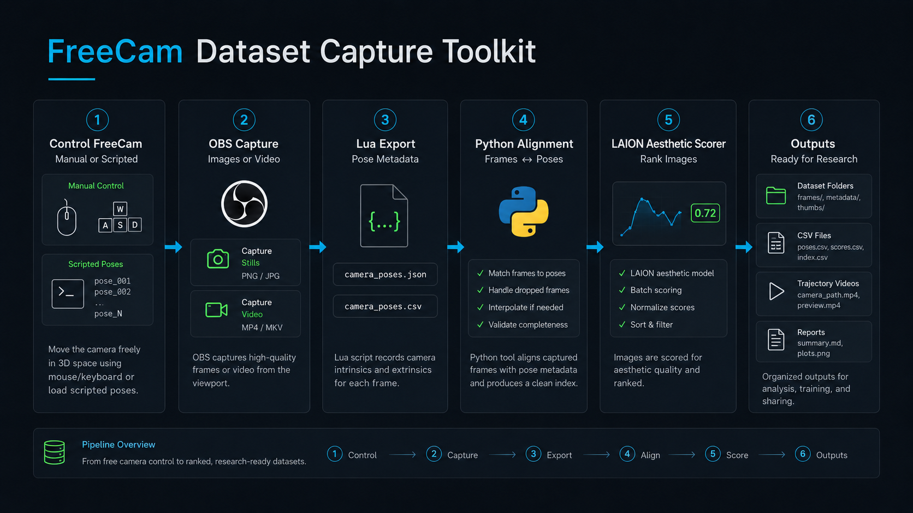
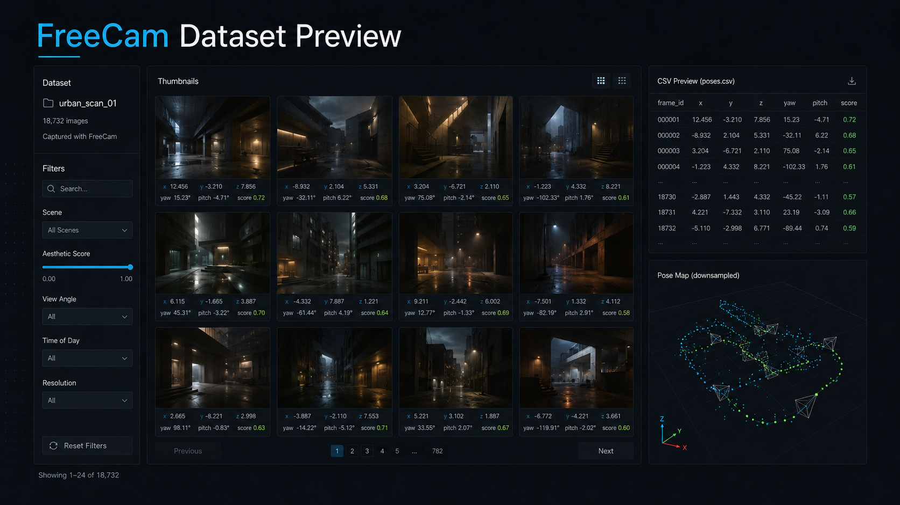
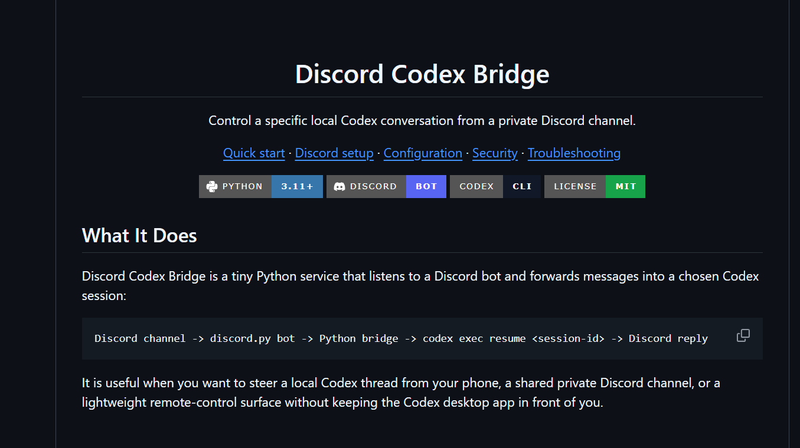

<div align="center">

# FreeCam Dataset Capture Toolkit

**OBS capture + pose logs + aesthetic scoring + trajectory replay for reproducible FreeCam datasets**

[Quick start](#python-setup) | [Define scan regions](#how-to-define-scan-regions) | [Still scans](#still-image-scan-datasets) | [Trajectory replay](#individual-commands) | [Linux](#installation) | [Safety](#what-this-project-does-not-do)




</div>

## What It Does

FreeCam Dataset Capture Toolkit turns a manually installed FreeCam + OBS setup into a repeatable capture pipeline:

```text
FreeCam poses -> OBS stills/videos -> Lua pose logs -> Python metadata -> LAION scores -> trajectories/reports
```

It collects reproducible still-image datasets, records trajectory videos, logs camera pose metadata, scores frames with the official LAION aesthetic predictor workflow, and writes outputs that are ready for analysis or downstream research.



<table>
  <tr>
    <td width="50%">
      
    </td>
    <td width="50%">
      
    </td>
  </tr>
  <tr>
    <td><b>One GUI for still scans and replay videos.</b><br>Start scans, remove broken captures, and record selected low-to-high trajectories through OBS.</td>
    <td><b>Trajectory replay from scored poses.</b><br>Use sampled viewpoints and aesthetic scores to build smooth camera-path videos.</td>
  </tr>
</table>

## Trajectory Demo

[](docs/assets/trajectory-demo.mp4)

Short captured trajectory clip generated by the local FreeCam + OBS replay workflow. Click the preview to open the mp4 slice.

## Pipeline



## Dataset Preview



## Platform Support

- Windows is the primary tested setup and uses `configs/default.yaml`.
- Linux is supported for Python, OBS WebSocket capture, still scans, trajectory replay, and LAION scoring when the game, REFramework, and FreeCam mod are installed through Steam Proton and configured with `configs/linux.yaml`.

## What This Project Does

- Backs up and minimally patches `RE9FreeCam.lua` with a reversible pose logger block.
- Communicates with Lua only through JSON files in `reframework/data`.
- Controls OBS through OBS WebSocket.
- Captures still images from OBS using configurable scan planes and view patterns.
- Records low-to-high trajectory replay videos from JSON path files.
- Can resume interrupted trajectory runs and optionally restart OBS between batches to release GPU memory.
- Writes per-image CSV metadata for position, yaw, pitch, dataset, and file path.
- Extracts video frames at a configured FPS.
- Scores frames using CLIP embeddings plus LAION aesthetic predictor weights.
- Aligns frame timestamps to camera pose timestamps.
- Generates `scores.csv`, `pose_log.csv`, `scores_with_pose.csv`, plots, copied top frames, and `report.html`.

## What This Project Does Not Do

- It does not control player movement or gameplay.
- It does not know the map collision mesh, so scan regions must be chosen by the user.
- It does not modify `RE9FreeCamPlugin.dll`.
- It does not read game memory from Python.
- It does not modify the game executable.
- It does not redistribute Nexus mods.
- It does not include game assets, raw full-length gameplay videos, game screenshots, generated datasets, model weights, or Nexus mod files.

README media note: most visual assets in this repository are generated UI illustrations plus a screenshot of this tool's own GUI. The only committed gameplay-derived media is a short compressed trajectory demo slice under `docs/assets/` for README preview.

## Installation

Windows is the primary tested setup and uses `configs/default.yaml`. Linux/Steam Proton users should use `configs/linux.yaml` or a local copy named `configs/linux.local.yaml`.

1. Install Resident Evil Requiem.
2. Install REFramework manually.
3. Install the RE9 FreeCam mod manually.
4. Confirm this Lua path exists, or edit `configs/default.yaml`:

```powershell
D:\steam\steamapps\common\RESIDENT EVIL requiem BIOHAZARD requiem\reframework\autorun\RE9FreeCam.lua
```

5. Install OBS Studio.
6. Enable OBS WebSocket:
   OBS -> Tools -> WebSocket Server Settings -> Enable WebSocket Server
   Port: `4455`
   Password: set one.
7. Install Python 3.10+.
8. Install Git.

Linux system packages:

```bash
# Ubuntu/Debian
sudo apt update
sudo apt install -y git python3 python3-venv python3-pip obs-studio libgl1 libglib2.0-0

# Fedora
sudo dnf install -y git python3 python3-pip obs-studio mesa-libGL glib2

# Arch
sudo pacman -S git python python-pip obs-studio
```

Linux game paths are usually one of:

```text
~/.steam/steam/steamapps/common/RESIDENT EVIL requiem BIOHAZARD requiem
~/.local/share/Steam/steamapps/common/RESIDENT EVIL requiem BIOHAZARD requiem
```

If Steam uses another library, right-click the game in Steam, open `Manage -> Browse local files`, and use that path.

## Required Nexus Mods

This repository does not include or redistribute Nexus mod files. Download and install these manually from Nexus Mods:

- [REFramework](https://www.nexusmods.com/residentevilrequiem/mods/13): a scripting/API framework for RE Engine games. This project relies on REFramework's Lua runtime, `reframework/autorun` script loading, and `reframework/data` file access so Python can communicate with Lua by JSON files.
- [RE9 FREECAM CED](https://www.nexusmods.com/residentevilrequiem/mods/1147): the Resident Evil Requiem FreeCam mod used to manually or scriptedly position the camera. The Nexus page lists REFramework as a requirement.

Install summary:

1. Install REFramework for Resident Evil Requiem following the Nexus mod instructions.
2. Install RE9 FREECAM CED after REFramework.
3. The FreeCam plugin DLL should be placed under:

```text
<game folder>/reframework/plugins/
```

4. The FreeCam Lua script should be placed under:

```text
<game folder>/reframework/autorun/
```

5. Confirm this file exists before patching:

```text
D:\steam\steamapps\common\RESIDENT EVIL requiem BIOHAZARD requiem\reframework\autorun\RE9FreeCam.lua
```

The Python patcher only backs up and modifies `RE9FreeCam.lua`. It never modifies the game executable, never modifies the FreeCam DLL, and never reads game memory from Python.

## Python setup

Windows:

```powershell
python -m venv .venv
.\.venv\Scripts\activate
pip install -r requirements.txt
python -m re9_pose_recorder.cli setup-laion
```

`requirements.txt` includes `-e .`, so the local `src/re9_pose_recorder` package is installed in editable mode and `python -m re9_pose_recorder.cli` works from the virtual environment.

Or use:

```powershell
.\scripts\setup_windows.ps1
.\scripts\setup_laion_repo.ps1
```

Linux:

```bash
bash scripts/setup_linux.sh
source .venv/bin/activate
cp configs/linux.yaml configs/linux.local.yaml
```

Then edit `configs/linux.local.yaml` and update the REFramework paths:

```yaml
game:
  lua_path: "/absolute/path/to/game/reframework/autorun/RE9FreeCam.lua"
  reframework_dir: "/absolute/path/to/game/reframework"
  reframework_data_dir: "/absolute/path/to/game/reframework/data"

lua_logger:
  control_file: "/absolute/path/to/game/reframework/data/re9_pose_control.json"
  status_file: "/absolute/path/to/game/reframework/data/re9_pose_status.json"
  pose_log_file: "/absolute/path/to/game/reframework/data/re9_freecam_pose_log.csv"
```

Use forward slashes. `~` and environment variables such as `$HOME` are expanded by the config loader.

On Linux, when `--config` is omitted, the CLI automatically tries:

```text
configs/linux.local.yaml
configs/linux.yaml
configs/default.yaml
```

You can also set a shell-wide override:

```bash
export RE9_CONFIG=configs/linux.local.yaml
```

Download/update the official LAION aesthetic-predictor repo:

```bash
python -m re9_pose_recorder.cli setup-laion --config configs/linux.local.yaml
```

## Patch Lua

The patcher creates a timestamped backup before it modifies `RE9FreeCam.lua`.
Injected Lua is contained only between:

```lua
-- BEGIN RE9_AESTHETIC_POSE_LOGGER
-- END RE9_AESTHETIC_POSE_LOGGER
```

Run:

```powershell
python -m re9_pose_recorder.cli check-lua
python -m re9_pose_recorder.cli backup-lua
python -m re9_pose_recorder.cli patch-lua-logger
python -m re9_pose_recorder.cli verify-lua-patch
```

Linux:

```bash
python -m re9_pose_recorder.cli check-lua --config configs/linux.local.yaml
python -m re9_pose_recorder.cli backup-lua --config configs/linux.local.yaml
python -m re9_pose_recorder.cli patch-lua-logger --config configs/linux.local.yaml
python -m re9_pose_recorder.cli verify-lua-patch --config configs/linux.local.yaml
```

## Test OBS

```powershell
python -m re9_pose_recorder.cli obs-test --obs-password YOUR_PASSWORD
```

Linux:

```bash
python -m re9_pose_recorder.cli obs-test --config configs/linux.local.yaml --obs-password YOUR_PASSWORD
```

If OBS is not running, WebSocket is disabled, the port is wrong, or the password is wrong, the command prints connection guidance.

Linux OBS capture notes:

- X11 users can usually use Window Capture or Game Capture if available.
- Wayland users usually need PipeWire Window Capture or Screen Capture.
- If the Python GUI appears in the recording, do not use full display capture. Use a source that targets only the game window.
- Use NVENC on NVIDIA, VAAPI on AMD/Intel, or x264 CPU encoding depending on your GPU and OBS build.

## Still image scan datasets

This is the current primary workflow. The scanner moves the FreeCam through configured `x/y/z` scan regions, captures OBS still images, and writes a CSV row for every image.

Before starting:

1. Start the game.
2. Enable FreeCam.
3. Open OBS and make sure the current Program scene captures the game cleanly.
4. Close the REFramework menu before capture begins. If the REFramework overlay is visible in OBS, it will be visible in the saved images.

Run the default street/upper-plane scan:

```powershell
python scripts\scan_stills_gui.py
```

Linux:

```bash
bash scripts/scan_scene01_gui.sh
```

Or use the generic Linux launcher, which selects `configs/linux.local.yaml` when it exists and otherwise falls back to `configs/linux.yaml`:

```bash
bash scripts/scan_gui.sh
```

Run the two-scene scan example:

```powershell
python scripts\scan_new_scenes_gui.py
```

The scene 2 launcher is portable: it loads the no-chandelier six-layer scan
from `scene_2_y01` and preloads the 15 low-to-high scene 2 trajectories from
`data/trajectory_exports/scene_2_true_keyframes_gain2p3_distance4_step4_singleanchor_smoke15_cluster3/`.
It does not depend on a Desktop path.

For another capture machine, copy the files under
`data/scene_2_capture/reframework/` into the game's `reframework/` directory,
preserving the `autorun/` and `data/` subdirectories. This installs the tested
Lua UI snapshot and the recorded scene point files used to build the scan
volume. Back up an existing `RE9FreeCam.lua` first if that machine has custom
changes.

Linux direct CLI equivalent:

```bash
python -m re9_pose_recorder.cli scan-stills-gui \
  --config configs/linux.local.yaml \
  --obs-password YOUR_PASSWORD \
  --layers-config configs/scene01_scan_layers.yaml \
  --session-id scene_1 \
  --settle-seconds 0.4 \
  --image-format jpg \
  --image-width 1920 \
  --image-height 1080 \
  --image-quality 100
```

The same GUI also includes the trajectory-video recorder. To load a custom trajectory JSON on Linux without editing Python files:

```bash
TRAJECTORY_JSON=/path/to/sample_trajectories.json \
TRAJECTORY_OUTPUT_DIR=data/videos/trajectories/my_scene \
TRAJECTORY_LABEL="my scene trajectories" \
TRAJECTORY_SESSION_PREFIX=my_scene_traj \
bash scripts/scan_gui.sh
```

For long unattended trajectory captures, the GUI writes a
`trajectory_run_state.json` file inside each run directory. Click
`Resume Latest Run` to continue the newest run from the first missing trajectory.
Completed trajectories are detected by checking the recorded video file, and
very small or missing files are treated as incomplete so they can be retried.

The trajectory GUI can also restart OBS between completed trajectories to release
GPU memory while keeping NVENC recording quality. Configure it with environment
variables before launching `scripts/scan_gui.sh`:

```bash
RE9_OBS_RESTART_EVERY_N=30 \
RE9_OBS_RESTART_WAIT_SEC=30 \
RE9_OBS_RESTART_COMMAND="/usr/bin/obs --collection RE9_Still_Scan --profile Untitled --disable-missing-files-check" \
bash scripts/scan_gui.sh
```

When enabled, OBS is restarted only between completed trajectories. The GUI then
waits for OBS WebSocket to reconnect before recording the next path. The control
window also periodically reasserts its topmost state so it stays reachable during
long runs.

Convenience launchers are included for the committed 4000-path exports:

```bash
bash scripts/scan_low_to_high4000_gui.sh
bash scripts/scan_topstart4000_gui.sh
```

`scripts/scan_low_to_high4000_gui.sh` defaults to
`RE9_OBS_RESTART_EVERY_N=30` and records to
`data/videos/trajectories/scene_1_1_low_to_high_4000_gain1p3`.

The scan definitions live in:

```text
configs/still_scan_layers.yaml
configs/scene_2_scan_layers.yaml
```

Each layer/zone defines a rectangular region using two diagonal points and a sampling density:

```yaml
layers:
  - id: scene01_plane01
    y: 13.91
    point_a: {x: -5.07, y: 12.53, z: -262.11}
    point_b: {x: 24.01, y: 13.91, z: -324.49}
    zones:
      - id: dense
        points_x: 12
        points_z: 12
```

### How to define scan regions

Edit one of these YAML files:

```text
configs/still_scan_layers.yaml
configs/scene_2_scan_layers.yaml
```

Use the FreeCam UI in REFramework to read the camera position. The FreeCam panel shows a line like:

```text
Pos: [x, y, z]
```

Choose two opposite corners of the region you want to scan, then copy those values into `point_a` and `point_b`.

Example:

```text
Corner A from FreeCam UI:
Pos: [-5.07, 12.53, -262.11]

Corner B from FreeCam UI:
Pos: [24.01, 13.91, -324.49]
```

Put them into YAML like this:

```yaml
layers:
  - id: scene01_plane01
    y: 13.91
    point_a:
      x: -5.07
      y: 12.53
      z: -262.11
    point_b:
      x: 24.01
      y: 13.91
      z: -324.49
    zones:
      - id: dense
        y: 13.91
        points_x: 12
        points_z: 12
        point_a:
          x: -5.07
          y: 12.53
          z: -262.11
        point_b:
          x: 24.01
          y: 13.91
          z: -324.49
```

Field meanings:

- `id`: name used in output folder names and CSV rows.
- `y`: the fixed scan height. In RE Engine coordinates here, `y` is vertical height.
- `point_a` / `point_b`: two diagonal corners of the rectangular scan area. The scanner uses their `x` and `z` values as the horizontal bounds.
- `zones`: one layer can contain one or more scan zones. Use this when you want a broad low-density area plus a smaller high-density focus area.
- `points_x`: number of sampled positions along the x axis.
- `points_z`: number of sampled positions along the z axis.

Image count formula:

```text
total_images = points_x * points_z * 22
```

For example:

```text
12 x 12 x 22 = 3168 images
10 x 16 x 22 = 3520 images
```

If a layer's two measured corners have slightly different `y` values, set the layer and zone `y` explicitly to the height you want to scan. The scanner will keep all positions on that fixed plane.

To add a second scene, add another item under `layers`:

```yaml
layers:
  - id: scene01_plane01
    ...

  - id: scene02_plane01
    y: 6.15
    point_a:
      x: 135.87
      y: 5.93
      z: -310.39
    point_b:
      x: 90.06
      y: 6.15
      z: -349.16
    zones:
      - id: dense
        y: 6.15
        points_x: 12
        points_z: 12
        point_a:
          x: 135.87
          y: 5.93
          z: -310.39
        point_b:
          x: 90.06
          y: 6.15
          z: -349.16
```

The two scenes will be saved to separate dataset folders under the same scan session.

For each position, the scanner captures 22 views:

- `pitch = 0`, yaw every 45 degrees: 8 images.
- `pitch = +45`, yaw every 60 degrees: 6 images.
- `pitch = -45`, yaw every 60 degrees: 6 images.
- `pitch = +90` and `-90`: 2 images.

Outputs are saved under:

```text
data/stills/scans/<session>/datasets/<dataset_id>/images/
data/stills/scans/<session>/datasets/<dataset_id>/samples.csv
data/stills/scans/<session>/samples.csv
```

Generated still images are ignored by Git. Do not commit game screenshots or datasets to this repository.

By default, the scanner captures the current OBS Program scene as PNG at the OBS Base Canvas resolution. For highest quality, set OBS `Settings -> Video -> Base Canvas Resolution` to the resolution you want before scanning. If your OBS Program scene includes overlays, menus, or display-capture artifacts, those will be saved too; use a clean Game Capture scene and close the REFramework UI with `Insert` before starting.

### Post-scan capture QA

After a scan finishes in the still-scan GUI, click `Delete Broken Capture Images`.
The GUI runs conservative capture QA on the session-level `samples.csv` and deletes
only obvious broken capture files.

You can also run the detector from the command line. By default, the CLI only
writes QA reports:

```powershell
python -m re9_pose_recorder.cli detect-inaccessible-points --samples data/stills/scans/SESSION/samples.csv
```

To delete the original image files for bad camera points from the CLI, add
`--delete-images`:

```powershell
python -m re9_pose_recorder.cli detect-inaccessible-points --samples data/stills/scans/SESSION/samples.csv --delete-images
```

The detector is image-based. It does not read game memory, does not know the collision mesh, and does not reliably detect clipping. It is intentionally conservative: sky, fog, walls, close surfaces, and other low-detail but valid views should be kept. It only flags obvious capture failures such as unreadable image files and nearly uniform black/white frames.

Important behavior:

- If one image from a camera point is flagged as a broken capture, the whole point is marked in the QA CSVs.
- The GUI cleanup button deletes original images for the broken capture point.
- The CLI deletes original images only when `--delete-images` is used.
- Use `valid_samples.csv` when you want a filtered dataset.
- Use `inaccessible_points.csv` as a legacy-named report of points that had broken captures.
- Use `deleted_images.csv` to audit exactly which original files were deleted.

Outputs are written to:

```text
data/stills/scans/SESSION/qa/
  still_quality.csv
  bad_views.csv
  inaccessible_points.csv
  invalid_samples_by_point.csv
  valid_samples.csv
  deleted_images.csv
```

### Experimental Physics Probe

The Lua patch includes an experimental REFramework-side physics probe. This is
the first step toward real clipping detection. It uses RE Engine physics APIs
found in the local SDK dump, including `via.physics.System.castRay` and
`via.physics.CastRayQuery`.

This probe does not read game memory from Python. Python only writes a JSON
control command; the Lua patch runs the physics query inside REFramework.

After patching Lua, restart the game or reload REFramework scripts, enable
FreeCam, then either click `Test Physics Probe` in `RE9 Aesthetic Pose Logger`
or run:

```powershell
python -m re9_pose_recorder.cli physics-probe --wait-sec 2
```

The status file will include:

```text
physics_probe_status
physics_probe_contacts
physics_probe_rays
physics_probe_error
```

If the probe returns `ok`, the next step is to use the contact count to skip or
blacklist candidate camera points before OBS captures them. The current probe is
intentionally diagnostic; it should be validated in-game before being used as a
hard dataset filter.

## Record and score

Start the game, enable/use the FreeCam manually, make sure OBS capture is configured, then run:

```powershell
python -m re9_pose_recorder.cli record-and-score --obs-password YOUR_PASSWORD --fps 2 --device cuda --top-k 50
```

Flow:

1. Python verifies the Lua file and patch.
2. Python verifies the LAION repo exists.
3. Python connects to OBS.
4. Python writes `re9_pose_control.json` with a new session id.
5. Lua starts writing pose CSV rows while FreeCam mode is active.
6. You press Enter to start OBS recording.
7. You manually fly the FreeCam.
8. You press Enter to stop.
9. Python stops OBS, tells Lua to stop, extracts frames, scores them, aligns pose, and writes reports.

To let the command clone/update LAION automatically:

```powershell
python -m re9_pose_recorder.cli record-and-score --obs-password YOUR_PASSWORD --fps 2 --device cuda --top-k 50 --auto-setup-laion
```

## One-click recording window

For a small button window that starts/stops OBS recording and Lua pose logging, with a live LAION aesthetic score from the cloned `LAION-AI/aesthetic-predictor` model:

```powershell
python -m re9_pose_recorder.cli one-click-record --obs-password YOUR_PASSWORD --device cuda
```

Or:

```powershell
.\scripts\one_click_record.ps1 -ObsPassword YOUR_PASSWORD -Device cuda
```

Click `Start Recording` once to start OBS and pose logging. The window periodically captures the current OBS Program scene, scores it with the LAION aesthetic predictor, and displays current/average/best scores. Click `Stop Recording` once to stop both. This records only; run `analyze-video` afterwards if you want full scoring/report generation.

The control window is topmost by default so it can float above the game. To keep it out of the recorded video, use OBS `Game Capture` for the game rather than `Display Capture`; Game Capture records the game content and not the Python control window.

During recording, the window can split the OBS recording into 5-second video segments, score every frame in each segment, and write the best frame from each segment:

```text
outputs/segment_best_5s_SESSION.csv
```

Each row contains the highest-scoring frame in that 5-second video segment plus nearest logged `x`, `y`, `z`, `yaw`, `pitch`, and `fov`. This uses OBS `split_record_file`, so OBS will produce multiple segment files while recording.

OpenCLIP/Hugging Face model files are cached under `third_party/huggingface_cache` so later launches reuse the project-local copy. Live score samples are saved under `outputs/live_scores_SESSION.csv`. Disable live scoring with:

```powershell
python -m re9_pose_recorder.cli one-click-record --obs-password YOUR_PASSWORD --no-live-score
```

To pre-download and load the live-score model before recording:

```powershell
python -m re9_pose_recorder.cli warmup-laion --device cuda
```

Linux uses the same command with the Linux config:

```bash
python -m re9_pose_recorder.cli one-click-record --config configs/linux.local.yaml --obs-password YOUR_PASSWORD --device auto
```

## Analyze existing video and pose log

```powershell
python -m re9_pose_recorder.cli analyze-video --video data/videos/session.mp4 --pose-log data/pose_logs/pose_log.csv --fps 2 --device cuda --top-k 50
```

Linux:

```bash
python -m re9_pose_recorder.cli analyze-video \
  --config configs/linux.local.yaml \
  --video data/videos/session.mp4 \
  --pose-log data/pose_logs/pose_log.csv \
  --fps 2 \
  --device auto \
  --top-k 50
```

## Individual commands

```powershell
python -m re9_pose_recorder.cli extract-frames --video data/videos/session.mp4 --out data/frames/session_001 --fps 2
python -m re9_pose_recorder.cli score-frames --input data/frames/session_001 --output outputs/scores.csv --device cuda --batch-size 32
python -m re9_pose_recorder.cli align-pose --scores outputs/scores.csv --pose-log data/pose_logs/re9_freecam_pose_log.csv --out outputs/scores_with_pose.csv
```

Build a sampled trajectory that climbs toward the best scored pose:

```powershell
python -m re9_pose_recorder.cli build-trajectory --scores-with-pose outputs/scores_with_pose.csv --out outputs/trajectory_to_best.csv --plot outputs/trajectory_to_best.png
```

The CSV is ordered low/starting pose to best sampled pose. Read it in reverse order for a high-to-low score trajectory.

Replay one trajectory through FreeCam and OBS:

```powershell
python -m re9_pose_recorder.cli replay-trajectory --obs-password YOUR_PASSWORD --trajectory-json data/trajectories/scene_1.1_low_to_high/trajectories.json --trajectory-index 1 --output-dir data/videos/trajectories/scene_1.1_low_to_high
```

Linux:

```bash
bash scripts/replay_trajectory.sh \
  --trajectory-json data/trajectories/scene_1.1_low_to_high/trajectories.json \
  --trajectory-index 1 \
  --output-dir data/videos/trajectories/scene_1.1_low_to_high
```

Every trajectory replay creates a new timestamped run folder so repeated captures do not overwrite previous videos or pose logs.

Pose logging only:

```powershell
python -m re9_pose_recorder.cli start-pose-log
python -m re9_pose_recorder.cli stop-pose-log --session-id 20260522_123000
```

## Restore Lua

```powershell
python -m re9_pose_recorder.cli restore-lua --backup backups/lua/RE9FreeCam.lua.TIMESTAMP.bak
```

Linux:

```bash
python -m re9_pose_recorder.cli restore-lua --config configs/linux.local.yaml --backup backups/lua/RE9FreeCam.lua.TIMESTAMP.bak
```

The restore command copies the selected backup over the configured `RE9FreeCam.lua`.

## Outputs

By default, outputs are written under `outputs/`:

- `scores.csv`: one row per extracted frame with LAION aesthetic score.
- `pose_log.csv`: copy of the Lua pose CSV for the session.
- `scores_with_pose.csv`: score rows aligned with `x`, `y`, `z`, `yaw`, `pitch`, and `fov`.
- `score_curve.png`: aesthetic score over time.
- `camera_path.png`: top-down `x` vs `z` camera path, colored by score when pose alignment exists.
- `top_frames/`: copied best frames named with rank, score, timestamp, and pose.
- `report.html`: summary, plots, top frames, and an aligned sample table.

If existing output files would be overwritten and `video.overwrite` is false, a timestamped/session output directory is created under `outputs/`.

## Error handling notes

- Wrong Lua path: edit `configs/default.yaml` on Windows or `configs/linux.local.yaml` on Linux, then rerun `check-lua`.
- Missing Lua patch: run `patch-lua-logger`.
- OBS connection failure: open OBS, enable WebSocket, confirm port `4455`, and check the password.
- Missing Git: install Git and rerun `setup-laion`.
- Missing LAION repo: run `setup-laion`.
- CUDA unavailable: the scorer falls back to CPU when `device` is `auto`, and warns when `cuda` was requested.
- Missing pose log after recording: video scoring can still continue, but pose alignment is marked invalid.
- Corrupted frames: skipped with warnings.

## Lua logger details

The Lua patch writes:

```text
session_id,timestamp_sec,x,y,z,yaw,pitch,fov,freecam_mode,user_has_rotated
```

It polls:

```text
reframework/data/re9_pose_control.json
```

and writes status to:

```text
reframework/data/re9_pose_status.json
```

Start control example:

```json
{
  "command": "start",
  "session_id": "20260522_123000",
  "pose_log_file": "D:/steam/steamapps/common/RESIDENT EVIL requiem BIOHAZARD requiem/reframework/data/re9_freecam_pose_log_20260522_123000.csv",
  "interval_sec": 0.033333
}
```

Stop control example:

```json
{
  "command": "stop",
  "session_id": "20260522_123000"
}
```

The patch uses `json.load_file` / `json.dump_file` when available, falls back to simple file IO where possible, and reports write errors in the REFramework UI/status file without intentionally crashing the game.

## Project layout

```text
re9-freecam-aesthetic-pose-recorder/
  configs/default.yaml
  src/re9_pose_recorder/
  data/videos/
  data/frames/
  data/pose_logs/
  outputs/
  scripts/
  third_party/
```

Run the CLI with:

```powershell
python -m re9_pose_recorder.cli
```

## README Layout Reference



This visual reference was used only to guide the README presentation style.
